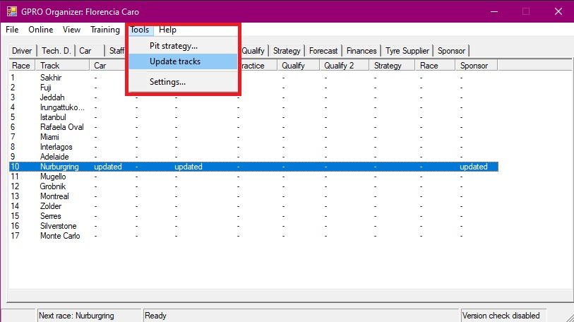
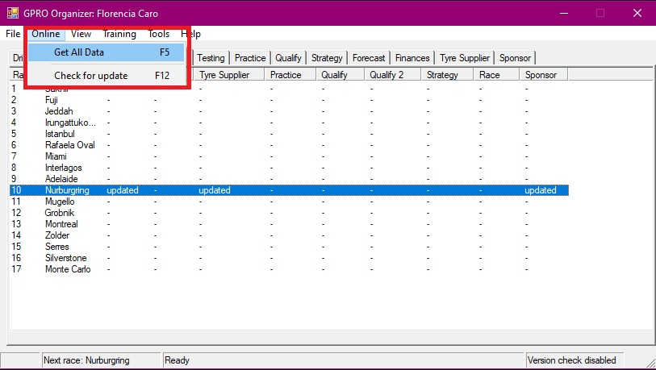
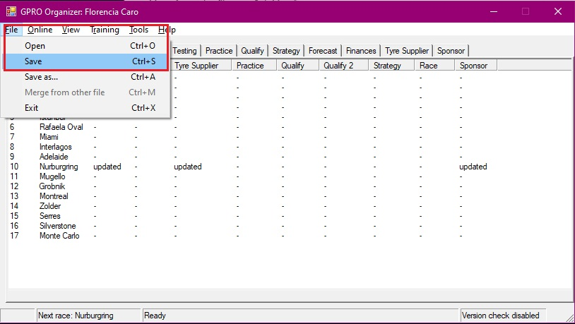

# GPRO Organizer

GPRO Organizer is a community-maintained desktop companion tool for [GPRO](https://gpro.net) players.

This application helps managers collect, store and analyze game data locally on their own computer.

> [!IMPORTANT]
> This is a legacy application currently maintained and distributed in portable format.
> No installer is required.

---

## Download

Releases are available at:

[GPRO Organizer Releases](https://github.com/MarFloCaro/GPRO-Organizer/releases)

Download the latest ZIP file from the **Assets** section of the most recent release.

---

## Installation

### New users

1. Download the latest release ZIP
2. Create a folder where you want to keep the application
3. Extract the ZIP contents into that folder
4. Run:

```text id="3m0jpk"
go.exe
```

---

### Existing users

If you already use GPRO Organizer and already have a `go.dat` file:

1. Download the latest release ZIP
2. Extract the new files into your existing application folder
3. Replace existing files when prompted

Your local data should remain preserved.

---

## First Startup

On first use — and usually after the first race of a new season — tracks data must be updated manually.

After opening the application:

### Step 1 — Update tracks

Navigate to:

```text id="p2u2k6"
Tools -> Update tracks
```



The application will generate the required `tracks.dat` file.

When the update finishes, the application will request a restart.

Close and reopen the application.

---

### Step 2 — Download your game data

After restarting:

Navigate to:

```text id="10m6m7"
Online -> Get All Data
```


---

### Step 3 — Save your data

After data download completes:

Navigate to:

```text id="tksr6q"
File -> Save
```



If this is your first use, the application will generate the `go.dat` file after saving, which stores your local data.

---

## Recommended Setup

For easier access, it is recommended to:

* create a desktop shortcut
* pin the application to the Start Menu
* or pin it to the taskbar

---

## Notes

* This application stores data locally on your computer.
* No cloud synchronization is performed.
* The application currently relies on legacy architecture and is under gradual modernization.
* Future versions are expected to transition away from scraping-based communication toward the official API.

---

## Project Status

This project is community maintained and currently focused on:

* preserving functionality
* improving distribution
* fixing critical issues
* modernizing infrastructure
* preparing future API-based evolution

---

## Maintainers

Ongoing maintenance:

- [Rafał Celejewski GitHub](https://github.com/Krumiasty)
- [Rafał Celejewski GPRO](https://gpro.net/ManagerProfile.asp?IDM=47036)

Community infrastructure, releases and distribution:

- [Flo Caro GitHub](https://github.com/MarFloCaro)
- [Flo Caro GPRO](https://gpro.net/ManagerProfile.asp?IDM=232105)

---

## License

See the repository license file for details.